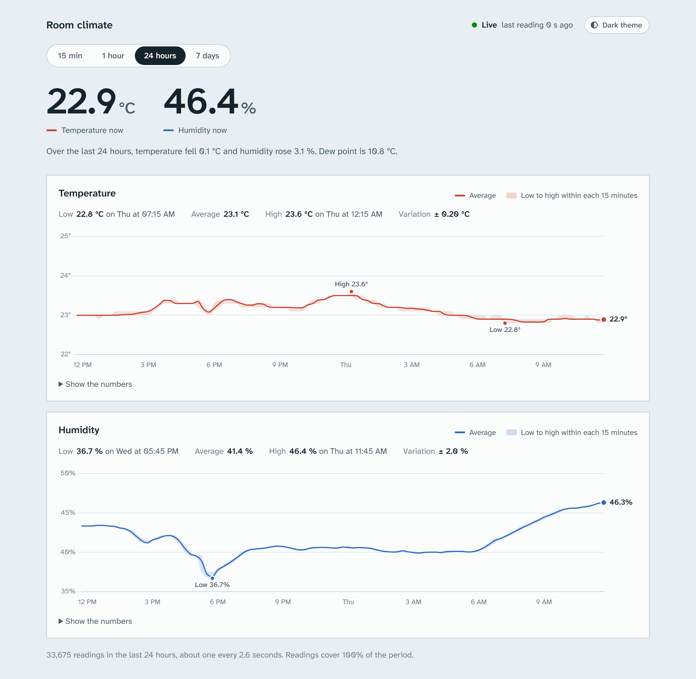
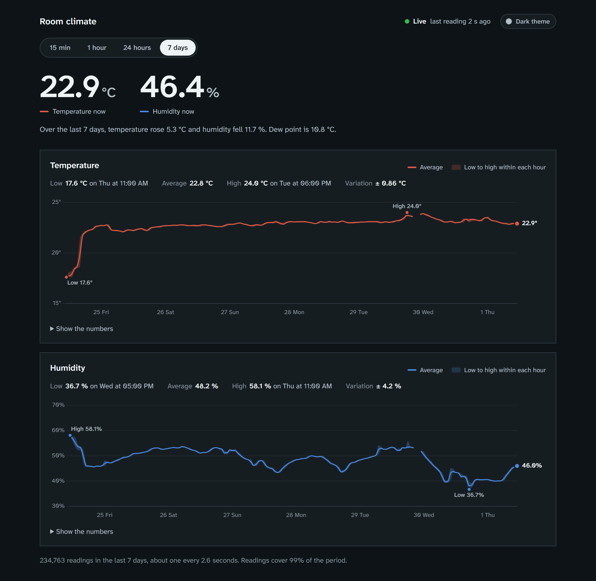

# ESP32 Sensor Dashboard

An ESP32 running MicroPython reads temperature and humidity from a DHT-22 sensor and posts it over WiFi to an Express + TypeScript server. The server validates each reading, stores it in SQLite, and serves a live dashboard with per-metric charts and statistics over 15-minute, 1-hour, 24-hour and 7-day windows.



<details>
<summary>Dark theme, 7-day view</summary>



</details>

## How it works

```
┌──────────────┐   HTTP POST (JSON)   ┌───────────────────┐        ┌──────────┐
│ ESP32        │ ───────────────────> │ Express + TS      │ ─────> │ SQLite   │
│ + DHT-22     │   every 60 s         │ zod validation    │        │ (file)   │
└──────────────┘                      └─────────┬─────────┘        └──────────┘
                                                │ GET /api/series?range=…
                                                ▼
                                      ┌───────────────────┐
                                      │ Browser dashboard │  Chart.js, polls every 15 s
                                      └───────────────────┘
```

## Features

**Charts**

- **Separate temperature and humidity charts.** Each shows an average line plus a shaded band for the low-to-high range inside each time slot, so short spikes stay visible after averaging.
- **Four time ranges** — 15 min, 1 hour, 24 hours, 7 days. Readings are grouped in SQL on the server, so a week of data (~10k rows) arrives as ~170 points.
- **Gaps are shown as gaps.** If the sensor goes quiet, the line breaks instead of drawing a straight line across the missing time.
- **The scale doesn't exaggerate noise.** Temperature always spans at least 2 °C and humidity at least 6 %, so the sensor's 0.1-step jitter stays flat.
- **Labels where they help:** the latest value at the end of each line, and the high and low of the range marked on the chart.
- **Hover for detail:** the time a point covers, its average, its low-to-high range, and how many readings went into it.
- **A table under every chart** ("Show the numbers") with the same data.

**Statistics**

- Current temperature and humidity, and how each changed over the selected range, in plain words
- Low and high with when they happened, average, and variation (standard deviation) for each metric
- Dew point, how often readings arrive, and how much of the range has data
- A status indicator that says whether the sensor is live, delayed, or offline

**Everything else**

- **Light and dark themes.** Follows your system setting until you pick one with the theme button; the choice is remembered.
- **Bookmarkable views.** The selected range is kept in the address, e.g. `http://localhost:3001/#1w`.
- **Works on phones**, with fewer axis labels on narrow screens.
- **Input validation.** Rejects malformed payloads and values outside the DHT-22's physical range (−40–80 °C, 0–100 %).

## What you need

### Hardware

| Part | Notes |
|---|---|
| ESP32 dev board | Original ESP32 (WROOM-32). S2/S3/C3 work too but need a different firmware file |
| DHT-22 sensor | Also sold as AM2302. A breakout board (3 pins) is easiest |
| 10 kΩ resistor | Only if your DHT-22 is a bare 4-pin sensor — breakout boards already include one |
| Jumper wires, USB data cable | The cable must carry data, not just power |

### Software

- **Node.js 22 or newer** — [nodejs.org](https://nodejs.org)
- **Python 3** with `pip` — used only for the ESP32 flashing tools, not on the server
- **Git**

The server and the ESP32 must be on the **same WiFi network**.

## Setup

### 1. Clone and install

```bash
git clone https://github.com/Qumetri/esp32-sensor-dashboard.git
cd esp32-sensor-dashboard
npm install
```

### 2. Start the server

```bash
npm run dev
```

This compiles the dashboard's TypeScript (`WebServer/client/` → `WebServer/public/js/`) and starts the server, restarting it when server code changes. If you're editing the dashboard itself, also run `npm run watch:client` in a second terminal so it recompiles on save, then refresh the browser.

You should see something like:

```
Database ready: WebServer/data/readings.db

Sensor dashboard listening on port 3001

  Local:    http://localhost:3001
  Network:  http://192.168.0.208:3001  (use this in the ESP32's SERVER_URL)
  Health:   http://localhost:3001/health
```

**Note the `Network` address** — the ESP32 needs it in step 7. Open `http://localhost:3001` and you'll see an empty dashboard waiting for data.

If several `Network` lines appear, the server is listing every network adapter on your machine. Pick the one on the same subnet as your router — usually `192.168.x.x` or `10.x.x.x` matching your home network. Ignore VPN adapters, virtual machine adapters (VirtualBox uses `192.168.56.x`), and `169.254.x.x` addresses, which mean an adapter with no real connection.

> **Windows:** the first time Node listens on the network, Windows Firewall may ask whether to allow it. Allow it on **private networks**, or the ESP32's requests will be silently dropped.

Leave this terminal running and open a new one for the next steps.

### 3. Install the ESP32 tools

```bash
pip install esptool mpremote
```

If `mpremote` isn't found afterwards, pip installed it outside your `PATH` — either add the directory pip printed in its warning to `PATH`, or run it as `python -m mpremote`.

### 4. Flash MicroPython onto the ESP32

Plug in the board, then find its serial port:

```bash
mpremote connect list
```

| OS | Port looks like |
|---|---|
| Windows | `COM4` |
| macOS | `/dev/cu.usbserial-0001` or `/dev/cu.wchusbserial*` |
| Linux | `/dev/ttyUSB0` |

**Nothing shows up?** Most ESP32 boards use a CH340 or CP2102 USB-serial chip that needs a driver on Windows and older macOS. Check which chip your board has and install its driver.

Download the latest **ESP32_GENERIC** `.bin` from [micropython.org/download/ESP32_GENERIC](https://micropython.org/download/ESP32_GENERIC/) (a known-good v1.29.0 build is also included in `ESP/`). Then erase and flash, replacing `COM4` with your port:

```bash
esptool --port COM4 erase-flash
esptool --port COM4 --baud 460800 write-flash 0x1000 ESP/ESP32_GENERIC-20260824-v1.29.0.bin
```

If esptool can't connect, **hold the BOOT button** on the board while the command starts, and release once you see it writing.

Confirm MicroPython is running:

```bash
mpremote connect COM4 exec "print('hello from esp32')"
```

### 5. Wire the sensor

| DHT-22 | ESP32 |
|---|---|
| VCC / + | 3V3 |
| GND / − | GND |
| DATA / OUT | GPIO 4 |

For a **bare 4-pin sensor** (pins left to right, grille facing you): pin 1 → 3V3, pin 2 → GPIO 4, pin 3 unused, pin 4 → GND, plus a 10 kΩ resistor between pin 2 and 3V3.

Two rules that cause silent failures:

- Use **3.3 V, not 5 V** — ESP32 pins aren't 5 V tolerant.
- **Don't use GPIO 34–39** — they're input-only, and the DHT-22 protocol needs a pin that can also output. GPIO 4 is a safe default.

Check the sensor works before going further:

```bash
mpremote connect COM4 exec "import dht, machine; d=dht.DHT22(machine.Pin(4)); d.measure(); print(d.temperature(), d.humidity())"
```

You should get two plausible numbers, like `22.4 47.1`. An `OSError` means a wiring problem — check the pin, the pull-up resistor, and the connections.

### 6. Install the HTTP library on the device

The firmware doesn't include `urequests`. Install it from your computer — no WiFi on the device required:

```bash
mpremote connect COM4 mip install urequests
```

### 7. Configure the firmware

Create your WiFi credentials file from the template:

```bash
# Windows
copy ESP\secrets.example.py ESP\secrets.py
# macOS / Linux
cp ESP/secrets.example.py ESP/secrets.py
```

Edit `ESP/secrets.py` with your network name and password. This file is gitignored.

Then open `ESP/main.py` and set `SERVER_URL` to the **Network** address from step 2, keeping the path:

```python
SERVER_URL = "http://192.168.0.208:3001/api/readings"
```

Use your computer's LAN address, never `localhost` — to the ESP32, `localhost` means the ESP32 itself.

### 8. Upload and run

Copy both files to the device:

```bash
mpremote connect COM4 cp ESP/secrets.py :secrets.py
mpremote connect COM4 cp ESP/main.py :main.py
```

Both are required — `main.py` imports `secrets.py` from the device's own filesystem, not from your computer.

Run it and watch the output:

```bash
mpremote connect COM4 run ESP/main.py
```

```
Connected, IP: 192.168.0.220
Temp: 22.4C  Humidity: 47.1%
Server responded: 201
```

Press `Ctrl+C` to stop watching. Because `main.py` is installed on the device, it now **runs automatically on every power-up** — you can unplug the ESP32 from your computer and power it from any USB charger.

### 9. Open the dashboard

Go to `http://localhost:3001` — readings should appear within a few seconds, and the status in the top right should say **Live** with a green dot. Any device on your network can view it at the `Network` address.

Pick a time range with the buttons above the charts. The longer ranges fill in as data builds up — a fresh install shows only a short line on the 7-day view, which is expected. Use **Dark theme** in the top right to switch themes.

## API

All endpoints are JSON.

### `POST /api/readings`

Stores a reading. The server adds the timestamp — clients can't set it.

```json
{ "temperature": 22.4, "humidity": 47.1 }
```

| Field | Rule |
|---|---|
| `temperature` | number, −40 to 80 |
| `humidity` | number, 0 to 100 |

Returns `201` with the stored reading, or `400` with a list of validation errors.

### `GET /api/series?range=1h`

Aggregated data for the dashboard. `range` is one of `15m`, `1h` (default), `1d`, `1w`.

| Range | Bucket size | Points |
|---|---|---|
| `15m` | 1 min | ~15 |
| `1h` | 1 min | ~60 |
| `1d` | 15 min | ~96 |
| `1w` | 1 h | ~168 |

Each point has the average, minimum and maximum of both metrics within its bucket, plus the sample count. The response also includes summary statistics for the whole range.

### `GET /api/readings`

Every stored reading, unaggregated. Useful for export; grows without limit, so prefer `/api/series` for display.

### `GET /health`

Returns a plain-text response if the server is up.

## Configuration

| Setting | Where | Default |
|---|---|---|
| Server port | `PORT` environment variable | `3001` |
| Posting interval | `INTERVAL_MS` in `ESP/main.py` | 60 s |
| Server address | `SERVER_URL` in `ESP/main.py` | — |
| Sensor pin | `dht.DHT22(Pin(4))` in `ESP/main.py` | GPIO 4 |

If you change the port, update `SERVER_URL` to match.

**On the posting interval:** room temperature changes slowly, so one reading a minute keeps the shape of every chart while keeping database writes low (about 1,440 a day). If you change it, also update `SEND_INTERVAL_MS` in `WebServer/client/config.ts`. The dashboard uses it to decide when the sensor counts as delayed, and how long a gap between readings must be before the charts show a break.

## Project structure

```
├── ESP/
│   ├── main.py              Firmware: WiFi, sensor loop, HTTP POST
│   ├── secrets.example.py   Template for WiFi credentials
│   └── *.bin                MicroPython firmware for ESP32
├── WebServer/
│   ├── index.ts             Express app: routes, validation, statistics
│   ├── db.ts                SQLite connection, schema, queries
│   ├── client/              Dashboard TypeScript (compiled to public/js/)
│   │   ├── main.ts          Entry point: fetching, polling, range and theme controls
│   │   ├── render.ts        Fills in readings, stats, charts and tables
│   │   ├── charts.ts        Chart.js setup and axis labels
│   │   ├── plugins.ts       Chart plugins: crosshair, high/low/latest labels
│   │   ├── tooltip.ts       Hover tooltip
│   │   ├── config.ts        Ranges and per-metric settings
│   │   └── types.ts         Shapes of the API response
│   ├── public/
│   │   ├── index.html       Dashboard markup
│   │   ├── styles.css       Dashboard styles and theme tokens
│   │   └── js/              Compiled client code — generated, gitignored
│   └── data/                SQLite database — created on first run, gitignored
├── docs/screenshots/        Images used in this README
├── NOTES.md                 Development log: decisions, gotchas, progress
└── package.json
```

## Tech stack

| Layer | Choice |
|---|---|
| Firmware | MicroPython on ESP32, `dht`, `network`, `urequests` |
| Server | Node.js 22, Express 5, TypeScript, run directly with `tsx` |
| Validation | zod |
| Storage | SQLite via `better-sqlite3` (raw SQL, no ORM) |
| Dashboard | HTML + CSS, TypeScript compiled with `tsc` (no bundler), Chart.js 4 from a CDN; Atkinson Hyperlegible Next from Google Fonts |

Design decisions and the reasoning behind them are recorded in [NOTES.md](NOTES.md).

## Troubleshooting

| Symptom | Cause and fix |
|---|---|
| `ImportError: no module named 'secrets'` | `secrets.py` isn't on the device. `mpremote run` sends only the file you name — copy `secrets.py` over with `mpremote cp` first. |
| `ImportError: no module named 'urequests'` | Run step 6. |
| ESP32 prints `POST failed` | Check `SERVER_URL` uses your computer's LAN IP (not `localhost`), the server is running, both devices are on the same network, and the firewall allows Node. |
| `WiFi connection failed` | Wrong credentials in `secrets.py`, or a 5 GHz-only network — the ESP32 supports 2.4 GHz only. |
| Every sensor read fails with `OSError` | Wrong pin, a GPIO 34–39 pin, 5 V instead of 3.3 V, or a missing pull-up on a bare sensor. Occasional failures are normal — the loop skips them. |
| `EADDRINUSE: address already in use` | Another server is already running on that port, often a terminal you forgot. Stop it with `Ctrl+C`, or on Windows: `Stop-Process -Id (Get-NetTCPConnection -LocalPort 3001).OwningProcess` |
| No serial port in `mpremote connect list` | Missing USB-serial driver (CH340/CP2102), or a charge-only USB cable. |
| Dashboard shows "Offline" or "Delayed" | No reading has arrived for over 5 minutes ("Offline") or 90 seconds ("Delayed", one missed reading) — the ESP32 is unpowered, off WiFi, or can't reach the server. |
| Breaks in the chart lines | Times when no readings arrived — the sensor was off, or the server wasn't running. The footer's coverage percentage shows how much of the range has data. |
| Charts look unstyled or use a different font | The page loads Chart.js and its font from the internet. Without internet access the charts won't draw; the font falls back to your system font. |
| VS Code underlines `machine`, `dht`, `network` | Editor-only, doesn't affect the device. Run `pip install micropython-esp32-stubs` and add that package's site-packages directory to `python.analysis.extraPaths`. |
